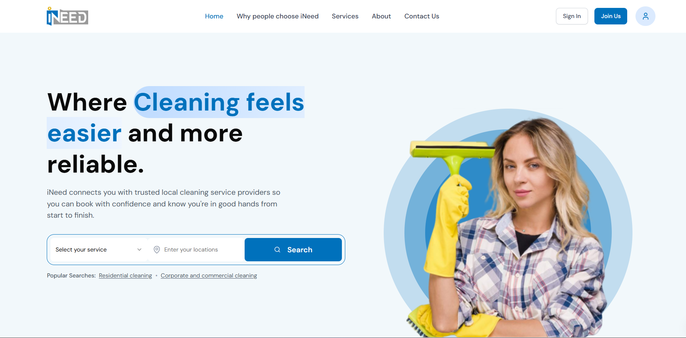
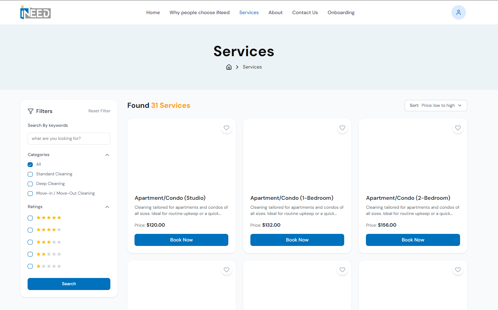
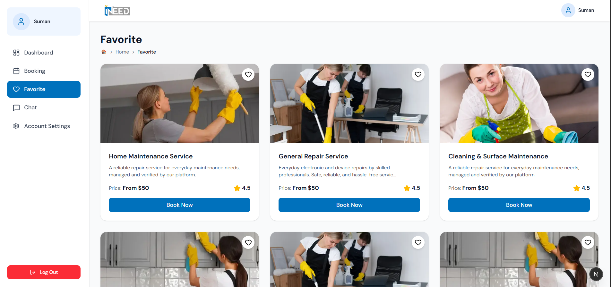
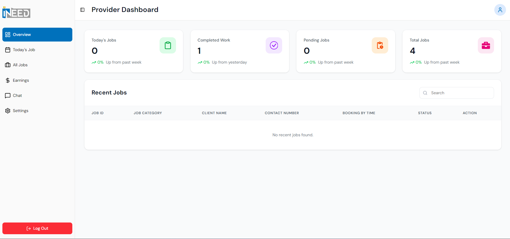
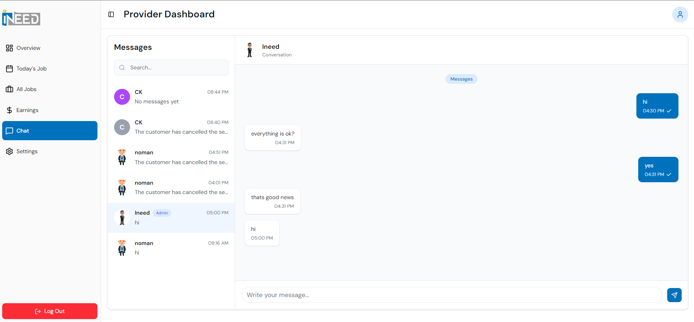

<div align="center">

# iNeed 🧼✨

> ⚡ Production-grade service marketplace frontend built with Next.js

**iNeed** is a modern web application that connects customers with trusted local cleaning service providers — enabling seamless service discovery, booking, payments, and real-time communication.


</div>

---

## 🌐 Live Demo

🔗 [https://hey-ineed.com](https://hey-ineed.com/)

> ⚠️ Some features (authentication, payments, chat) may require valid backend credentials.

---

## 📚 Table of Contents

- 📖 Project Overview
- 🚀 Why this Project?
- 💡 My Contribution
- 🧰 Tech Stack
- ✨ Key Features
- 📸 Screenshots
- 🧠 Challenges & Learnings
- 🗂️ Project Structure
- 🛠️ Installation
- 🔐 Environment Variables
- 📦 Scripts
- 🚀 Build & Deployment
- 🔐 Security Note

---

## 📖 Project Overview

This repository contains the **frontend** of iNeed, built using the **Next.js App Router**.

It includes:

- Public marketing pages (services, categories, policies)
- Customer booking flow (multi-step)
- User dashboard (bookings, chat, favorites, settings)
- Provider dashboard (jobs, earnings, availability, profile & legal info)
- Real-time chat powered by WebSockets

---

## 🚀 Why this Project?

iNeed was built to simplify the process of finding and booking trusted cleaning services through a smooth and modern digital experience.

The goal was to design a **scalable, real-world marketplace frontend** with clean architecture and production-ready practices.

---

## 💡 My Contribution

- Built full frontend architecture using **Next.js App Router**
- Designed scalable state management using **Redux Toolkit & RTK Query**
- Implemented **real-time chat system** using WebSockets
- Developed **multi-step booking flow** with validation
- Integrated API handling with proper error & loading states
- Structured reusable UI components using **shadcn/ui + Tailwind**
- Managed forms with **React Hook Form + Zod validation**

---

## 🧰 Tech Stack

### Core

- Next.js (App Router)
- React
- TypeScript

### UI & Styling

- Tailwind CSS
- Radix UI
- shadcn/ui
- lucide-react
- react-icons

### State, Data & Forms

- Redux Toolkit
- RTK Query
- React Hook Form
- Zod

### Utilities

- date-fns
- embla-carousel-react

---

## ✨ Key Features

- 🔐 Authentication (Login, Signup, OTP, Password Reset)
- 🧭 Provider onboarding system
- 🧹 Service discovery & categories
- ⭐ Favorites management
- 🗓️ Multi-step booking system
- 💳 Payment integration (via backend)
- 🧑‍💼 User dashboard
- 🧰 Provider dashboard
- 💬 Real-time chat (WebSockets)
- 🔔 Toast notifications

---

## 📸 Screenshots Gallery

<div align="center">
  <p>Explore the iNeed user interface across different modules.</p>

| 🏠 Home Page | 🧼 Service Details | ❤️ Favorites |
| :---: | :---: | :---: |
|  |  |  |

<br />

| 📊 Dashboard | 💬 Real-time Chat |
| :---: | :---: |
|  |  |

</div>

---

## 🧠 Challenges & Learnings

- Managing complex multi-step booking state
- Handling real-time communication using WebSockets
- Designing scalable folder structure in Next.js App Router
- Optimizing API state management with RTK Query
- Building reusable and maintainable UI components

---

## 🗂️ Project Structure


```
src/
	app/
		(auth)/
			signin/ signup/ forgot-password/ reset-password/
			verify-email/ verify-reset-otp/ onbording/
		(main)/
			page.tsx
			services/ categories/ booking/[serviceId]/
			privacy-policy/ provider-policy/ customer-policy/ pricing-fair-use-policy/
		(dashboard)/
			user/    (bookings, chat, favorites, settings)
			provider (jobs, earnings, chat, availability, legal info, settings)
	components/
	redux/
	hooks/
	schemas/
	types/
	lib/
```


---

### Install dependencies

```bash
npm install
```

### Run development server

```bash
npm run dev
```

Open: http://localhost:3000

---

## 🔐 Environment Variables

Create a `.env.local` file in the root directory:

```env
NEXT_PUBLIC_BACKEND_BASE_URL=your-backend-url
```

> ⚠️ This project uses a private production backend. Some features may not work without valid credentials.

---

## 📦 Scripts

```bash
npm run dev     # Start development server
npm run build   # Build for production
npm run start   # Run production server
npm run lint    # Lint code
```

---

## 🚀 Build & Deployment

```bash
npm run build
npm run start
```

Ensure environment variables are properly configured in your deployment platform.

---

## 🔐 Security Note

This is a production-level project. Sensitive configurations such as API endpoints, authentication systems, and payment integrations are intentionally restricted.

---

## 🙌 Final Note

This project demonstrates my ability to build scalable, production-ready frontend applications using modern tools, clean architecture, and best practices.
